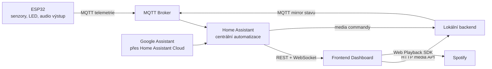
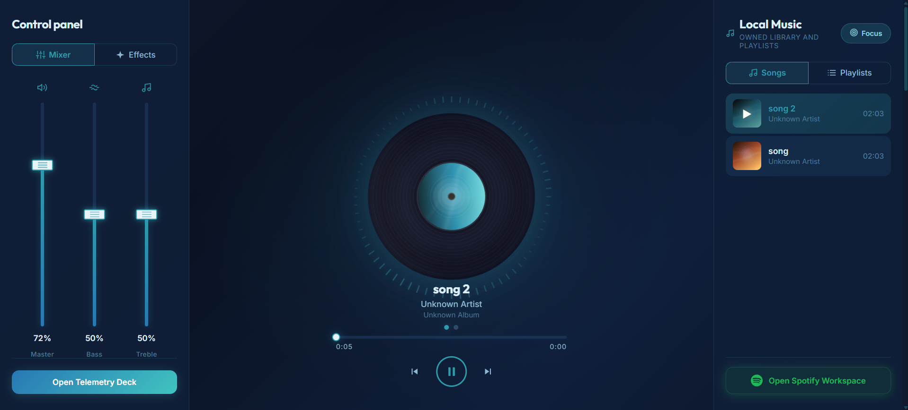
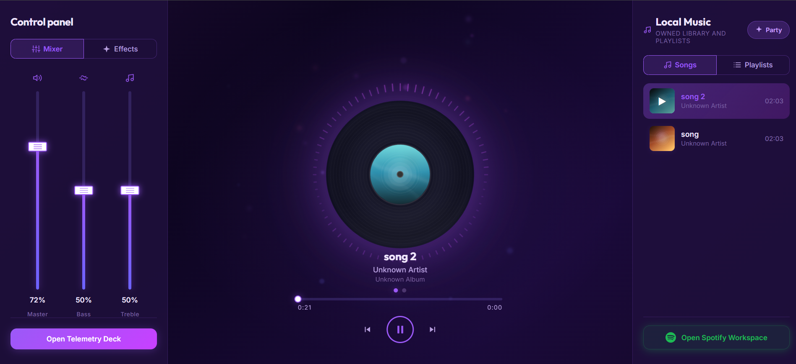
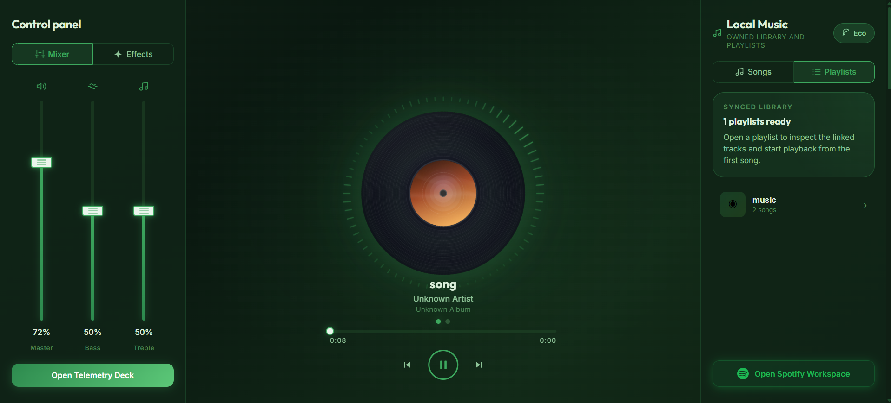
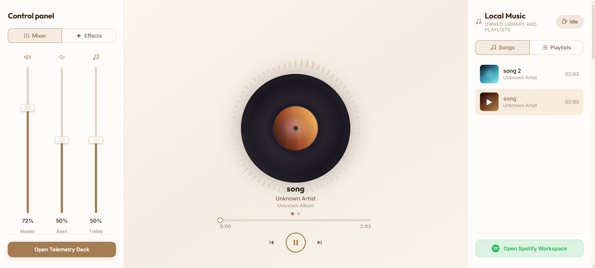
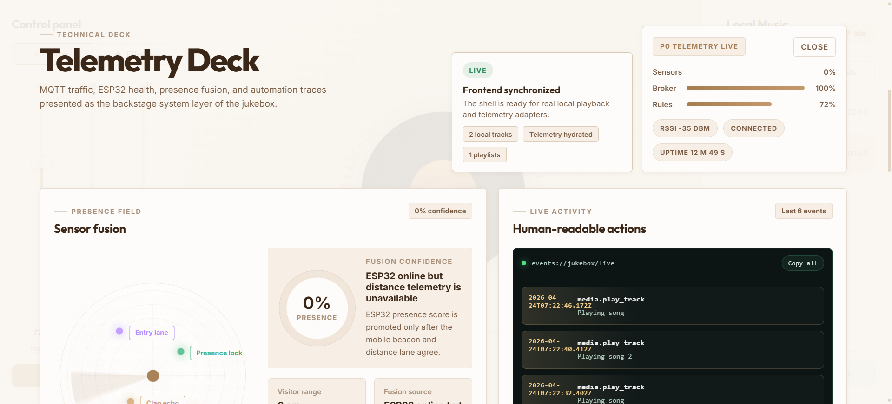
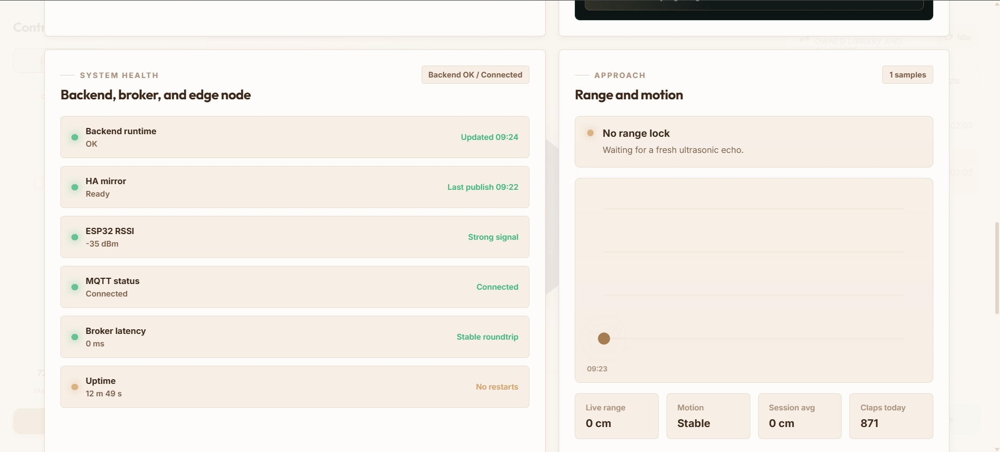

# Smart Jukebox


Chytrý jukebox postavený kolem `Home Assistant`, jednoho uzlu `ESP32`, lokálního mediálního backendu a vlastního frontendového dashboardu. Projekt kombinuje automatizaci chytré domácnosti, živou telemetrii, lokální hudbu, `Spotify` a hlasové ovládání do jednoho demo-ready celku.

Původně vznikl jako školní showcase, ale aktuálně už funguje jako ucelený lokální systém s jasnou architekturou, viditelnými automatizacemi a prezentovatelným UI. Praktická práce je v tuto chvíli považovaná za dokončenou. Další rozvoj může cílit hlavně na security, deployment hardening a dlouhodobou stabilitu.


## Co projekt umí

- `Home Assistant` jako centrální mozek pro automatizaci, monitoring a entity
- `ESP32` telemetrie přes `MQTT`
- frontendový dashboard s přehrávačem, logy, health monitoringem a `Telemetry Deck`
- lokální `MP3` knihovna s backendem pro stav přehrávání, playlisty a stream
- `Spotify` browser playback, vyhledávání a playlisty
- `Google Assistant` integrace přes `Home Assistant Cloud`
- automatizované režimy `Focus`, `Party`, `Eco` a `Idle`
- clap shortcut pro ovládání médií
- experimentální audio výstup `ESP32 -> I2S zesilovač -> reproduktor`

## Proč je projekt zajímavý

Nejde jen o další webový přehrávač. Cílem bylo postavit malý, ale uvěřitelný smart-home scénář, ve kterém je hudba propojená s děním v místnosti.

Jukebox proto:

- reaguje na přítomnost a pohyb
- sbírá a zobrazuje živou telemetrii
- ukazuje logy a trace mezi senzorem a akcí
- kombinuje software, hardware i automatizaci do jednoho toku

Výsledek je dobře demonstrovatelný jak na obrazovce, tak fyzicky na hardware.

## Architektura



### Role jednotlivých částí

- `Home Assistant` drží automatizace, entity, normalizaci stavu a monitoring
- `ESP32` sbírá fyzická data z místnosti a publikuje je do `MQTT`
- backend řeší lokální hudbu, playlisty, stav přehrávání a mediální API
- frontend spojuje hudební rozhraní s technickou observabilitou
- `Spotify` a `Google Assistant` rozšiřují základní lokální scénář o bonusové funkce

## Hlavní funkce

### Režimy

- `Focus`: klidovější režim navázaný na přítomnost
- `Party`: výraznější režim s aktivnější vizuální signalizací
- `Eco`: úsporný fallback při odchodu nebo neaktivitě
- `Idle`: výchozí neutrální stav

<p align="center">
  
  
</p>
<p align="center">
  
  
</p>

### Telemetry Deck

`Telemetry Deck` dělá z projektu skutečný monitoring panel, ne jen skrytou automatizaci na pozadí.

Zobrazuje:

- distance a presence data
- clap count
- RSSI, uptime a stav zařízení
- live event log
- raw activity stream ve stylu topic feedu
- návaznost `sensor -> decision -> action`

<p align="center">
  
  
</p>

### Média

- lokální `MP3` knihovna
- browser playback ve frontendu
- playlisty a výběr skladeb
- synchronizovaný playback state
- ovládání hlasitosti
- `Spotify` search, playlisty a browser playback

### Hlasové ovládání

Projekt podporuje `Google Assistant` přes `Home Assistant Cloud`, takže je možné spouštět přehrávání nebo měnit režimy hlasem či přes mobilní rutiny.

### Hardware vrstva

Fyzická část je záměrně viditelná a jednoduchá na ukázku:

- `ESP32`
- ultrazvukový senzor
- mikrofon / clap input
- adresovatelné LED
- volitelný `I2S` audio výstup přes zesilovač

## Jak to celé funguje

1. `ESP32` čte signály z místnosti, například vzdálenost nebo clap aktivitu.
2. Telemetrie se publikuje do lokálního `MQTT` brokeru.
3. `Home Assistant` telemetrii přijímá, převádí ji na entity a spouští automatizace.
4. Backend drží lokální hudební katalog, playback state a media commandy.
5. Frontend čte telemetrii z `Home Assistant` a média z backendu.
6. `Spotify` a `Google Assistant` doplňují základní lokální flow, ale nenahrazují ho.

## Použité komponenty

### Hardware

- `ESP32 Dev Module`
- `HC-SR04`
- mikrofonní modul pro clap detekci
- `WS2812` / `NeoPixel`
- `I2S` zesilovač, například `MAX98357A`
- malý reproduktor

Detailní zapojení, Arduino setup a pin mapping jsou v [esp/README.md](./esp/README.md).

### Software a platformy

- `Home Assistant`
- `MQTT`
- `Docker Compose`
- `Eclipse Mosquitto`
- `Node.js`
- `Fastify`
- `React`
- `TypeScript`
- `Vite`
- `Vitest`
- `Arduino IDE`

### Integrace

- `Spotify Web API`
- `Spotify Web Playback SDK`
- `Google Assistant`
- `Home Assistant Cloud / Nabu Casa`

## Rychlý runtime přehled

Preferovaný runtime je lokální `Docker Compose` stack:

```bash
docker compose up -d --build
```

Výchozí lokální endpointy:

- `Home Assistant`: `http://127.0.0.1:8123`
- `Frontend`: `http://127.0.0.1:5173`
- `Backend`: `http://127.0.0.1:3000`
- `MQTT broker`: `127.0.0.1:1883`

Detailní setup:

- [homeassistant/SETUP-DOCKER.md](./homeassistant/SETUP-DOCKER.md)
- [homeassistant/SETUP-VIRTUALBOX.md](./homeassistant/SETUP-VIRTUALBOX.md)
- [esp/README.md](./esp/README.md)

## Aktuální stav projektu

Projekt je aktuálně v dobrém showcase stavu:

- end-to-end telemetrie funguje
- automatizace režimů jsou implementované
- lokální playback funguje
- frontend umí monitoring, logy i media control
- `Spotify` funguje jako rozšířená ukázková vrstva
- `Google Assistant` je integrovaný přes `Home Assistant Cloud`
- audio přes `ESP32` bylo ověřeno jako experimentální hardware feature

Co by šlo ještě dále dopracovat:

- security a zabezpečení komunikace
- deployment hardening
- stabilita pro delší běh
- další polish některých integračních hran

## Rozcestník repozitáře

- Frontend overview: [frontend/README.md](./frontend/README.md)
- Frontend plan: [frontend/MASTER-PLAN.md](./frontend/MASTER-PLAN.md)
- Backend overview: [backend/README.md](./backend/README.md)
- Backend tasks: [backend/TODO.md](./backend/TODO.md)
- Home Assistant overview: [homeassistant/README.md](./homeassistant/README.md)
- Google Assistant setup: [homeassistant/GOOGLE-ASSISTANT-SETUP.md](./homeassistant/GOOGLE-ASSISTANT-SETUP.md)
- Docker setup: [homeassistant/SETUP-DOCKER.md](./homeassistant/SETUP-DOCKER.md)
- VirtualBox setup: [homeassistant/SETUP-VIRTUALBOX.md](./homeassistant/SETUP-VIRTUALBOX.md)
- Home Assistant tasks: [homeassistant/TODO.md](./homeassistant/TODO.md)
- ESP32 firmware and wiring: [esp/README.md](./esp/README.md)
- Main architecture plan: [docs/idea/master-plan.md](./docs/idea/master-plan.md)
- Current status summary: [docs/current-status.md](./docs/current-status.md)
- Assignment brief: [docs/assignment/assignment.md](./docs/assignment/assignment.md)

## Závěr

Tohle už není jen scaffold nebo školní prototyp. Repo dnes představuje funkční smart jukebox showcase s viditelným hardwarem, viditelnými automatizacemi, živou telemetrií a vlastním frontendem.

Pokud se na něm bude pokračovat dál, největší smysl dává dotáhnout security, deployment a dlouhodobou provozní stabilitu. Z hlediska produktu a prezentace už ale projekt drží pohromadě.
